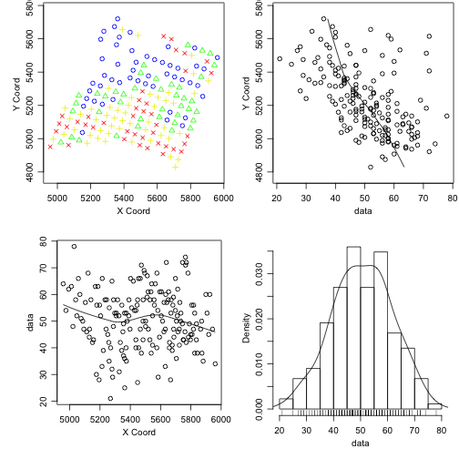

<br />

In this vignette it's shown a case study for `georrtest` package functions with `camg` dataset
, available on `geoR` package.

Even though the `georrtest` package contains just specific functions to test the significance of Pearson
correlation coefficient for geostatistical data, this vignette contains all steps for geostatistical
data analysis, since exploratory to modelling and assessing correlation between variables. The idea
is to provide not only the technical instructions for using `georrtest` package, but also to
show its context.

<br />

## I. Exploratory analysis


```r

## General settings
# options( width = 100 )
# set.seed( 123 )

## Packages and sources
library( georrtest )

library( ggplot2 )
library( ggthemes )
require( gridExtra )

library( skimr )
library( dplyr )


## Settings
theme_set( theme_few() )
```


```r
data.frame( camg ) %>% select( -east, -north, -region, -elevation ) %>% skim %>% kable
```

Skim summary statistics  
 n obs: 178    
 n variables: 6    

Variable type: integer

|variable |missing |complete |n   |mean  |sd    |p0 |p25 |median |p75 |p100 |hist     |
|:--------|:-------|:--------|:---|:-----|:-----|:--|:---|:------|:---|:----|:--------|
|ca020    |0       |178      |178 |50.68 |11.08 |21 |43  |50.5   |58  |78   |▁▂▅▇▇▆▃▂ |
|ca2040   |0       |178      |178 |45.01 |13.54 |21 |34  |44     |56  |79   |▆▇▇▇▇▆▂▁ |
|mg020    |0       |178      |178 |27.34 |6.28  |11 |23  |27     |32  |46   |▁▂▇▇▇▇▁▁ |
|mg2040   |0       |178      |178 |25.58 |6.6   |10 |21  |25.5   |30  |43   |▁▅▆▆▇▅▂▁ |

Variable type: numeric

|variable |missing |complete |n   |mean   |sd    |p0   |p25   |median |p75    |p100  |hist     |
|:--------|:-------|:--------|:---|:------|:-----|:----|:-----|:------|:------|:-----|:--------|
|ctc020   |0       |178      |178 |132.19 |18.36 |72   |122.2 |132.25 |141.08 |186.2 |▁▁▂▆▇▃▁▁ |
|ctc2040  |0       |178      |178 |126.98 |22.05 |73.1 |114.4 |128    |138.67 |212.4 |▂▂▆▇▃▁▁▁ |

```r

## Select data
layer020 <- as.geodata( camg, coords.col = c(1,2), data.col = c(5,6), covar.col = 4 )
names( layer020 )
```

$coords
[1] "east"  "north"

$data
[1] "ca020" "mg020"

$covariate
[1] "region"

<br />

The analysis will be performed with `ca020` and `mg020` variables.

<br />

### Geodata Plots

Looking to objects as geodata. Defaults plots of this class show:

<ol>
<li>Quantiles plot (top-left)</li>
<li>X coordinate trend (bottom-left)</li>
<li>Y coordinate trend (top-right)</li>
<li>Histogram of residuals from specific model (bottom-right)</li>
</ol>

<br />

#### Ca020 data without trend

On quantiles plots bellow we see spatial patterns on `ca020` distribution, since quantile values 
are concentrated in some plot regions. On scatter plots, we see an almost linear
negative trend on $y$ coordinate (North-South direction in this dataset). And a
third-degree trend on $x$ coord (East-West on this dataset).

Geospatial models are intend to catch underlying variables, which effect is seen
as spatial patterns, but are not modeled by any other known variable.

So, as first step in this EA, let's look at `ca020` models with possible trends,
to visually see how geospatial models can improve the understanding of this variable.


```r

layer020$data <- as.data.frame( layer020$data )
plot.geodata( layer020, data = layer020$data$ca020, lowess = TRUE, trend = "cte" )
```




#### Ca020 data with trend on region

Region co-variable has captured some information on `ca020` variable. Notice that quantiles
plot bellow are not so structures as before and the $Y$ coordinate trend has changed from linear
to a second-degree trend.


```r
plot.geodata( layer020, data = layer020$data$ca020, lowess = TRUE, trend = ~region )
```


Next plots show some other model possibilities.

#### Ca020 data with first degree trend

This first degree model is a model from data with a first degree effect on coordinates. This model has also
captured part of the spatial pattern.


```r
plot.geodata( layer020, data = layer020$data$ca020, lowess = TRUE, trend = "1st" )
```


#### Ca020 data with trend on region and east and north coords together

The model for next plots combine region and coordinates effects, with interaction in coordinates effects.


```r
plot.geodata( layer020, data = layer020$data$ca020, lowess = TRUE, trend = ~ region + layer020$coords[, 1] * layer020$coords[,2] )
```


<br />
<br />

Now let's do the same for `Mg020` variable

#### Mg020 data without on region


```r
plot.geodata( layer020, data = layer020$data$mg020, lowess = TRUE, trend = "cte" )
```


#### Mg020 data with trend on region


```r
plot.geodata( layer020, data = layer020$data$mg020, lowess = TRUE, trend = ~region )
```


#### Mg020 data with first degree trend


```r
plot.geodata( layer020, data = layer020$data$mg020, lowess = TRUE, trend = "1st" )
```


#### Mg020 data with secind degree trend


```r
plot.geodata( layer020, data = layer020$data$mg020, lowess = TRUE, trend = "2nd" )
```


## Variograms

Another important plot on exploring data on geospatial analysis is the variogram, which shows us how data
varies among them in function of their distances.


<br />
<br />

## II. Model parameters Estimation

### Ca020


```r
ml.ca <- lapply( 1:length( trends )
              , function( t ){
                  if( trends[t] == "region" ){
                      likfit( layer020, data = layer020$data[, "ca020"], ini = vgfit$ca020[[ t ]]$cov.pars, trend = ~region, message = F )
                  }else{
                      likfit( layer020, data = layer020$data[, "ca020"], ini = vgfit$ca020[[ t ]]$cov.pars, trend = trends[ t ], message = F )
                  }

              } )

ca.model.fit.pars <- data.frame( sapply( ml.ca,
                                        function( m ){
                                            rbind( c( m$nospatial$loglik.ns, m$loglik )
                                                , c( m$nospatial$AIC.ns, m$AIC )
                                                , c( m$nospatial$BIC.ns, m$BIC )
                                                , m$npars )
                                        } ) )
ca.model.fit.pars <- ca.model.fit.pars[ -4, ]
```


<br />

### Mg020


```r
ml.mg <- lapply( 1:length( trends )
              , function( t ){

                  if( trends[t] == "region" ){
                      likfit( layer020, data = layer020$data[, "mg020"], ini = vgfit$mg020[[ t ]]$cov.pars, trend = ~region, message = F )
                  }else{
                      likfit( layer020, data = layer020$data[, "mg020"], ini = vgfit$mg020[[ t ]]$cov.pars, trend = trends[ t ], message = F )
                  }

              } )

mg.model.fit.pars <- data.frame( sapply( ml.mg,
                                        function( m ){
                                            rbind( c( m$nospatial$loglik.ns, m$loglik )
                                                , c( m$nospatial$AIC.ns, m$AIC )
                                                , c( m$nospatial$BIC.ns, m$BIC )
                                                , m$npars )
                                        } ) )
mg.model.fit.pars <- mg.model.fit.pars[ -4, ]
```


### Model choosing

Model fitting metrics

<table class='gmisc_table' style='border-collapse: collapse; width: 700px' >
<thead>
<tr><td colspan='5' style='text-align: left;'>
Ca020 models</td></tr>
<tr>
<th style='border-bottom: 1px solid grey; border-top: 2px solid grey;'> </th>
<th style='border-bottom: 1px solid grey; border-top: 2px solid grey; text-align: center;'>cte</th>
<th style='border-bottom: 1px solid grey; border-top: 2px solid grey; text-align: center;'>region</th>
<th style='border-bottom: 1px solid grey; border-top: 2px solid grey; text-align: center;'>1st</th>
<th style='border-bottom: 1px solid grey; border-top: 2px solid grey; text-align: center;'>2nd</th>
</tr>
</thead>
<tbody>
<tr>
<td style='text-align: left;'>loglik.ns</td>
<td style='text-align: center;'>-680.19</td>
<td style='text-align: center;'>-654.40</td>
<td style='text-align: center;'>-651.31</td>
<td style='text-align: center;'>-640.21</td>
</tr>
<tr>
<td style='text-align: left;'>AIC.ns</td>
<td style='text-align: center;'>1364.38</td>
<td style='text-align: center;'>1316.81</td>
<td style='text-align: center;'>1310.61</td>
<td style='text-align: center;'>1294.43</td>
</tr>
<tr>
<td style='text-align: left;'>BIC.ns</td>
<td style='text-align: center;'>1370.74</td>
<td style='text-align: center;'>1329.53</td>
<td style='text-align: center;'>1323.34</td>
<td style='text-align: center;'>1316.70</td>
</tr>
<tr>
<td style='text-align: left;'>loglik</td>
<td style='text-align: center;'>-632.60</td>
<td style='text-align: center;'>-629.33</td>
<td style='text-align: center;'>-629.39</td>
<td style='text-align: center;'>-641.95</td>
</tr>
<tr>
<td style='text-align: left;'>AIC</td>
<td style='text-align: center;'>1273.19</td>
<td style='text-align: center;'>1270.65</td>
<td style='text-align: center;'>1270.79</td>
<td style='text-align: center;'>1301.90</td>
</tr>
<tr>
<td style='text-align: left;'>BIC</td>
<td style='text-align: center;'>1285.92</td>
<td style='text-align: center;'>1289.74</td>
<td style='text-align: center;'>1289.88</td>
<td style='text-align: center;'>1330.54</td>
</tr>
<tr>
<td style='border-bottom: 2px solid grey; text-align: left;'>npars</td>
<td style='border-bottom: 2px solid grey; text-align: center;'>4.00</td>
<td style='border-bottom: 2px solid grey; text-align: center;'>6.00</td>
<td style='border-bottom: 2px solid grey; text-align: center;'>6.00</td>
<td style='border-bottom: 2px solid grey; text-align: center;'>9.00</td>
</tr>
</tbody>
</table><table class='gmisc_table' style='border-collapse: collapse; width: 700px' >
<thead>
<tr><td colspan='5' style='text-align: left;'>
Mg020 models</td></tr>
<tr>
<th style='border-bottom: 1px solid grey; border-top: 2px solid grey;'> </th>
<th style='border-bottom: 1px solid grey; border-top: 2px solid grey; text-align: center;'>cte</th>
<th style='border-bottom: 1px solid grey; border-top: 2px solid grey; text-align: center;'>region</th>
<th style='border-bottom: 1px solid grey; border-top: 2px solid grey; text-align: center;'>1st</th>
<th style='border-bottom: 1px solid grey; border-top: 2px solid grey; text-align: center;'>2nd</th>
</tr>
</thead>
<tbody>
<tr>
<td style='text-align: left;'>loglik.ns</td>
<td style='text-align: center;'>-579.03</td>
<td style='text-align: center;'>-562.61</td>
<td style='text-align: center;'>-578.25</td>
<td style='text-align: center;'>-553.35</td>
</tr>
<tr>
<td style='text-align: left;'>AIC.ns</td>
<td style='text-align: center;'>1162.07</td>
<td style='text-align: center;'>1133.21</td>
<td style='text-align: center;'>1164.50</td>
<td style='text-align: center;'>1120.69</td>
</tr>
<tr>
<td style='text-align: left;'>BIC.ns</td>
<td style='text-align: center;'>1168.43</td>
<td style='text-align: center;'>1145.94</td>
<td style='text-align: center;'>1177.23</td>
<td style='text-align: center;'>1142.97</td>
</tr>
<tr>
<td style='text-align: left;'>loglik</td>
<td style='text-align: center;'>-542.84</td>
<td style='text-align: center;'>-537.87</td>
<td style='text-align: center;'>-542.65</td>
<td style='text-align: center;'>-538.04</td>
</tr>
<tr>
<td style='text-align: left;'>AIC</td>
<td style='text-align: center;'>1093.69</td>
<td style='text-align: center;'>1087.74</td>
<td style='text-align: center;'>1097.29</td>
<td style='text-align: center;'>1094.08</td>
</tr>
<tr>
<td style='text-align: left;'>BIC</td>
<td style='text-align: center;'>1106.41</td>
<td style='text-align: center;'>1106.83</td>
<td style='text-align: center;'>1116.39</td>
<td style='text-align: center;'>1122.71</td>
</tr>
<tr>
<td style='border-bottom: 2px solid grey; text-align: left;'>npars</td>
<td style='border-bottom: 2px solid grey; text-align: center;'>4.00</td>
<td style='border-bottom: 2px solid grey; text-align: center;'>6.00</td>
<td style='border-bottom: 2px solid grey; text-align: center;'>6.00</td>
<td style='border-bottom: 2px solid grey; text-align: center;'>9.00</td>
</tr>
</tbody>
</table>

<br /> 

  * Based on loglik, AIC and BIC index, the spatial model with the **region** co-variable with be chosen to 'ca020' variable.
  * Based on loglik, AIC and BIC index, the spatial model with the **region** co-variable with be chosen to 'mg020' variable.


```r
## Constant mean model
ml.ca.cte <- ml.ca$cte
ml.mg.cte <- ml.mg$cte

## Model choosing
trend.ca <- "region"
trend.mg <- "region"
ml.ca <- ml.ca[[ trend.ca ]]
ml.mg <- ml.mg[[ trend.mg ]]

## Ca model
ml.ca
#> likfit: estimated model parameters:
#>    beta0    beta1    beta2    tausq  sigmasq      phi 
#> "39.712" " 8.035" "13.806" " 3.265" "98.696" "72.611" 
#> Practical Range with cor=0.05 for asymptotic range: 217.5237
#> 
#> likfit: maximised log-likelihood = -629.3

## Mg model
ml.mg
#> likfit: estimated model parameters:
#>    beta0    beta1    beta2    tausq  sigmasq      phi 
#> "18.782" " 8.766" " 7.968" " 6.605" "26.396" "76.716" 
#> Practical Range with cor=0.05 for asymptotic range: 229.8222
#> 
#> likfit: maximised log-likelihood = -537.9
```
<br />
<br />
<br />

## III. Krigging


```r
## summary( layer020$coords )
pred.grid <- expand.grid( seq( min( layer020$coords[, 1] ), max( layer020$coords[, 1] ), l = 100 )
                       , seq( min( layer020$coords[, 2] ), max( layer020$coords[, 2] ), l = 100 ) )
## Krigging
krig.ca <- krige.conv( layer020, data = layer020$data[, 1], loc = pred.grid
                    , krige = krige.control( obj.m = ml.ca ) )
krig.mg <- krige.conv( layer020, data = layer020$data[, 2], loc = pred.grid
                    , krige = krige.control( obj.m = ml.mg ) )
```


<br />

## IV. Correlation analysis

### Naive

Regarding to our interest on assessing the significance of correlation coefficient between variables, let's first of all 
check its value and a "naive" approach for assessing its significance, without considering the auto-dependence on variables.


```
#> 
#> 	Pearson's product-moment correlation
#> 
#> data:  layer020$data[, 1] and layer020$data[, 2]
#> t = 4.6183, df = 176, p-value = 7.445e-06
#> alternative hypothesis: true correlation is not equal to 0
#> 95 percent confidence interval:
#>  0.1909115 0.4539002
#> sample estimates:
#>       cor 
#> 0.3287644
```

<br />

Let's, then, see the three MMC implemented.

### MMC Non-parametric

For this method, it's shown two implementations: permuting only `Ca020` and only `Mg020`.

Note that to permute only `Mg020`, this variable is the passed as `X` arg.

On both examples, `mmc.variog.rtest` call is done providing respective variograms objects,
according to the recommended use of the method.


```r

nSim <- 1e3

dists <- as.vector( dist( layer020$coords ) )
h.min <- quantile( dists, probs = 0.04 )
h.max <- quantile( dists, probs = 0.4 )

## region, ca
t.np <- system.time(

    res.mmc.np <- mmc.variog.rtest(
      geodata = layer020
      , vg.X = vg.ca
      , h.min = h.min, h.max = h.max
      , nSimMMC = nSim )
    
)

## region, mg
res.mmc.np.mg <- mmc.variog.rtest( 
  geodata = layer020
  , X = layer020$data[, 2]
  , Y = layer020$data[, 1]
  , coords = layer020$coords
  , vg.X = vg.mg
  , h.min = h.min, h.max = h.max
  , nSimMMC = nSim )
```

<br />

### MMC Parametric - Permutation

As what was done for Non-parametric method, for Parametric with permutation
method, it's shown the case when applying the permutation either for `Ca020`,
either for `Mg020`.

In this method, the metric used for evaluate the spatial pattern on convoluted data is the
MLE model parameters. Since the best models were with region as co-variable,
these are which will be used (one for `Ca020` variable and the other for `Mg020` variable.


```r

## region, ca
t.pp <- system.time(
    res.mmc.pp <- mmc.likfit.rtest( layer020
                                 , h.min = h.min, h.max = h.max
                                 , likfit.X = ml.ca
                                 , nSimMMC = nSim )
)

## region, mg
res.mmc.pp.mg <- mmc.likfit.rtest( X = layer020$data[, 2]
                                , Y = layer020$data[, 1]
                                , coords = layer020$coords
                                , h.min = h.min, h.max = h.max
                                , likfit.X = ml.mg
                                , nSimMMC = nSim )
```

<br />

### MMC Parametric - Model based

Model-based method were also applied using likfit parameters for models
with region as co-variables.


```r

## region, ca
t.mb <- system.time(
    res.mmc.mb <- mmc.modelbased.rtest( layer020
                                     , h.min = h.min, h.max = h.max
                                     , likfit.X = ml.ca
                                     , nSimMMC = nSim )
)

## region, mg
res.mmc.mb.mg <- mmc.modelbased.rtest( X = layer020$data[, 2]
                                    , Y = layer020$data[, 1]
                                    , coords = layer020$coords
                                    , h.min = h.min, h.max = h.max
                                    , likfit.X = ml.mg
                                    , nSimMMC = nSim )
```

<br />

### Comparision


<center>

<table class='gmisc_table' style='border-collapse: collapse; width: 700px;' >
<thead>
<tr>
<th style='border-bottom: 1px solid grey; border-top: 2px solid grey;'> </th>
<th style='border-bottom: 1px solid grey; border-top: 2px solid grey; text-align: center;'>Naive</th>
<th style='border-bottom: 1px solid grey; border-top: 2px solid grey; text-align: center;'>Non-parametric</th>
<th style='border-bottom: 1px solid grey; border-top: 2px solid grey; text-align: center;'>Parametric - Permutation</th>
<th style='border-bottom: 1px solid grey; border-top: 2px solid grey; text-align: center;'>Parametric - Model based</th>
</tr>
</thead>
<tbody>
<tr>
<td style='text-align: left;'>p-value</td>
<td style='text-align: center;'>0.0000</td>
<td style='text-align: center;'>0.0010</td>
<td style='text-align: center;'>0.0070</td>
<td style='text-align: center;'>0.0030</td>
</tr>
<tr>
<td style='text-align: left;'>$sd_{p.value}$</td>
<td style='text-align: center;'>0.0733</td>
<td style='text-align: center;'>0.1075</td>
<td style='text-align: center;'>0.1266</td>
<td style='text-align: center;'>0.1179</td>
</tr>
<tr>
<td style='border-bottom: 2px solid grey; text-align: left;'>Time (min.) </td>
<td style='border-bottom: 2px solid grey; text-align: center;'></td>
<td style='border-bottom: 2px solid grey; text-align: center;'>1.5719</td>
<td style='border-bottom: 2px solid grey; text-align: center;'>9.9861</td>
<td style='border-bottom: 2px solid grey; text-align: center;'>0.0018</td>
</tr>
</tbody>
</table>

</center>

<br />

As expected, all MC methods produced a more conservative significance for Pearson correlation coefficient than the theoretical, which doesn't consider the auto-dependence on data.

The parametric method with permutation is the most time consuming, since at each step it does optimizations
to estimate model coefficients through MLE. However, its spatial model is more precise than that estimated with variograms. 

When to use each one of these method is case-dependent. Basically, if you have a good geostatistical model 
estimation, use the model based with simulations. Otherwise, if you were able to produce model estimations
for spatial components, but don't want to be so dependent of this, use parametric permutation method. And,
in the case when you need a non-parametric method, use this version, taking variograms estimations to do so.

<br />
<br />

<br />
<br />
<br />
<br />
<br />
<br />


