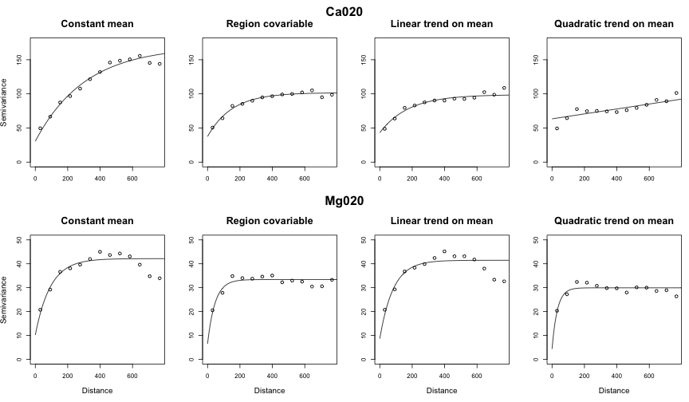

# I. Exploratory analysis
Case study with soil dataset. This is a multivaiable dataset and the
research was interested on significance of Pearson correlation
coefficient between MO and K variables. So those will be the analysed variables.

```{r, echo = TRUE, message = FALSE, results = 'hide'}

## General settings
options( width = 100 )
set.seed( 123 )
old.par <- par( no.readonly = T )

## Packages and sources
require( georrtest )
require( data.table )
require( MASS )
require( xtable )
require( truncnorm )
#source( "analytical.methods.R" )

##
## Load data
##
dt <- read.table( "solo.txt", header = T, colClasses = "numeric" )
soil <- as.geodata( dt, coords.col = c(1,2), data.col = c(3:22) )
names( soil$data ) <- names( dt )[3:22]

```

```{r, echo = TRUE, fig.show = F}
## Summary
## plot( data.frame( soil$data ) )
## summary( soil$data )

with( data.frame( soil$data ), cor.test( MO, K ) )

```
The Pearson correlation between MO and K is equals to
-0.3475638. Based on naive test, its p-value is euqals
to 0.01441. Using the significance of 0.01 we will reject the null
hypothesis and to decide that these variables are not correlated. But,
using the significance of 0.05 we will reject the null hypothesis that
theses variables are independent ($H_0: r = 0.00$).
<br />

Moreover, those results may yet not to be precise. Before to decide it (probably based on research knownledge), let's see it these variables are
autodependent, i.e., let's take a look on their spatial pattern.


## Basic plots

```{r, echo = FALSE, message = FALSE, results = 'hide', fig.width = 10, fig.height = 10}

MO <- data.frame( soil$data )$MO
K <- data.frame( soil$data )$K
mean(K)
sd(K)

data.vectors <- list( MO, K )
data.names <- c("MO", "K" )

par( mfrow = c(2,2) )
d <- lapply( data.vectors, density )

sapply( 1:2, function(i){
    plot( d[[i]], main = data.names[i] )
} )

boxcox( lm( data.vectors[[1]] ~ 1 )  )
title( data.names[1] )
boxcox( lm( data.vectors[[2]] ~ 1 )  )
title( data.names[2] )

```
Both MO and K seem to be Normal distributed, which allow us to proceed
with our analysis wihtout any need for transforming.

<br />
## Geodata Plots
Looking to objects as geodata. Defaults plots of this class show:
<ol>
	<li>Quantiles plot (top-left)</li>
	<li>X coordinate trend (bottom-left)</li>
	<li>Y coordinate trend (top-right)</li>
	<li>Histogram (bottom-right)</li>
</ol>
<br />
```{r, soil-mo, echo = FALSE, message = FALSE, fig.width = 10, fig.height = 10, fig.show = 'hide'}
plot( soil, data = MO, lowess=TRUE )
plot( soil, data = MO, lowess=TRUE, trend = "1st" )

```
```{r, soil-k, echo = FALSE, message = FALSE, fig.width = 10, fig.height = 10, fig.show = 'hide'}
plot( soil, data = K, lowess=TRUE )
plot( soil, data = K, lowess=TRUE, trend = "1st" )

```


### MO Varaible
#### No trend model

<br />

#### First degree trend model

<br />


### K Varaible
#### No trend model

<br />

#### First degree trend model

<br />

******
## Variograms
Build empirical and theoretical variograms from variables.

```{r, empirical-vgs, echo = FALSE, message = FALSE, results = 'hide', warning = FALSE, fig.width = 7, fig.height = 6, fig.show = 'hide'}
trends <- c( "cte", "1st", "2nd" )
vg <- lapply( data.vectors
           , function( x ){
               lapply( trends
                    , function( t ){
                        variog( geodata = soil, data = x, trend = t )
                    } )
           } )

names( vg ) <- data.names

names( vg[[1]] ) <- trends
names( vg[[2]] ) <- trends

## Theoretical variograms
vgfit <- lapply( vg
              , function( vars ){
                  lapply( vars, variofit )
              } )
names( vgfit ) <- data.names
names( vgfit[[1]] ) <- trends
names( vgfit[[2]] ) <- trends

## Plots
par( mfrow = c( 2,2 ) )
title.vg <- c("Média constante", "Covariável região", "Média com tendência linear", "Média com tendência quadrática")
sapply( 1:2,
       function( i ){
           sapply( 1:2
                , function( t ){
                    ## plot( vg[[ i ]][[ t ]], main = c( names(vg)[i], paste( "Trend: ", trends[t] ) ) )
                    ## lines( vgfit[[ i ]][[ t ]] )

                    plot( vg[[ i ]][[ t ]], main = title.vg[t], cex.main = 1.25, ylim = c(0, ifelse(i == 1, 1, 0.12) )
                       , xlab = ifelse( i == 1, "", "Distância"), ylab = ifelse( t == 1 , "semivariância", ""), cex.lab = 1.1 )
                    lines( vgfit[[ i ]][[ t ]] )

                } )
       } )

par( xpd = TRUE )

title( "MO", outer = T, line = -1.5, cex.main = 2 )
title( "K", outer = T, line = -19, cex.main = 2 )

```

<br />

<br />
<br />
******
# II. Model parameters Estimation

## MO

```{r, echo = TRUE, message = FALSE, results = 'hide', warning = FALSE}
ml.mo <- lapply( 1:2
              , function( t ){
                  likfit( soil, data = MO, ini = vgfit$MO[[ t ]]$cov.pars
                       , trend = trends[ t ]
                       , message = F )
              } )

mo.model.fit.pars <- data.frame( sapply( ml.mo,
                                        function( m ){
                                            rbind( c( m$nospatial$loglik.ns, m$loglik )
                                                , c( m$nospatial$AIC.ns, m$AIC )
                                                , c( m$nospatial$BIC.ns, m$BIC ) )
                                        } ) )

```
```{r, echo = FALSE, message = FALSE, results = 'hide', warning = FALSE}
rownames( mo.model.fit.pars ) <- c("loglik.ns", "AIC.ns", "BIC.ns", "loglik", "AIC", "BIC" )
colnames( mo.model.fit.pars ) <- trends[1:2]
names( ml.mo ) <- trends[1:2]

```

Model fitting metrics
```{r, echo  =F, results = 'asis'}
## mo.model.fit.pars
print( xtable( mo.model.fit.pars )
    , type = "html", include.rownames = T, floating = F )


```

Based on loglik, the better model is the spatial with a first degree
trend on mean component. Based on AIC, it is th constant
mean. Actually, the criterium are a bit close to each other for
constant and first degree trend models. But looking at the data versus
coordinates plots and remembering we have few observations, we will
choose the model with constant mean for this variable.

```{r}
ml.mo

```

Notice the 'beta0' parameter for spatial model with a 1st order trend
is totally unreasonable ($ ml.mo[[2]]$beta0 $). Remembering the
variograms, the best fit was also this model. So, we'll chose the
spatial no-trend model for 'MO' variable.
<br />

## K
```{r, echo = TRUE, message = FALSE, results = 'hide', warning = FALSE}
ml.k <- lapply( 1:2
              , function( t ){
                  likfit( soil, data = K, ini = c(1, 100) ##vgfit$K[[ t ]]$cov.pars
                       , trend = trends[ t ], message = F )
              } )

k.model.fit.pars <- data.frame( sapply( ml.k,
                                        function( m ){
                                            rbind( c( m$nospatial$loglik.ns, m$loglik )
                                                , c( m$nospatial$AIC.ns, m$AIC )
                                                , c( m$nospatial$BIC.ns, m$BIC ) )
                                        } ) )

```
```{r, echo = FALSE, message = FALSE, results = 'hide', warning = FALSE}
rownames( k.model.fit.pars ) <- c("loglik.ns", "AIC.ns", "BIC.ns", "loglik", "AIC", "BIC" )
colnames( k.model.fit.pars ) <- trends[1:2]
names( ml.k ) <- trends[1:2]

```
Model fitting metrics
```{r, echo  =F, results = 'asis'}
## lapply( ml.k, summary )
## k.model.fit.pars
print( xtable( k.model.fit.pars )
    , type = "html", include.rownames = T, floating = F )

```

### Model choosing
For K variable, the highest logLik value occured on 1st rend model,
both to spatial and no spatial models. The the lowest AIC value is
from no spatial model with a first degree trend, and so this will be choosen.

It'll won't be possible to apply the analytical methodologies. But, as
the 'MO' variable had a detected spatial pattern, let's proceed with the
MMC methodologies, with the one-side (MO variable) shuffling option.


```{r}
## Model choosing
trend.mo <- "cte"
trend.k <- "cte"
ml.mo <- ml.mo[[ trend.mo ]]
ml.k <- ml.k[[ trend.k ]]
```
<br />

```{r, krigging, echo = TRUE, message = FALSE, results = 'hide', warning = FALSE, eval = FALSE}

pred.grid <- expand.grid( seq( min( soil$coords[, 1] ), max( soil$coords[, 1] ), l = 100 )
                       , seq( min( soil$coords[, 2] ), max( soil$coords[, 2] ), l = 100 ) )

## Krigging
krig.mo <- krige.conv( soil, data = MO, loc = pred.grid
                    , krige = krige.control( obj.m = ml.mo ) )
krig.k <- krige.conv( soil, data = K, loc = pred.grid
                    , krige = krige.control( obj.m = ml.k ) )

```

```{r, krigging-maps, echo = FALSE, message = FALSE, results = 'hide', warning = FALSE, fig.width = 10, fig.heinght = 10, fig.show = 'hide', eval = FALSE}
## Plots
par( mfrow = c(1,2) )
image( krig.mo, loc = pred.grid, col = terrain.colors( 50 )
    , xlab="Coord X", ylab="Coord Y", main = "MO" )
image( krig.k, loc = pred.grid, col = terrain.colors( 50 )
    , xlab="Coord X", ylab="Coord Y", main = "K" )

```
<br />
<br />
******
# IV. Correlation analysis

## Naive
```{r, echo = F}
cor.naive <- cor.test( MO, K )
cor.naive

```
```{r, cor-plot, eval = TRUE, echo = FALSE, message = FALSE, results = 'hide', warning = FALSE, fig.width = 10, fig.heinght = 10, fig.show = 'hide'}
par( xpd = FALSE, mfrow = c(1,1), mar = c(5,4.5,2,2) )
plot( K ~ MO, main = "Dispersão entre MO e K" ##, xlim = c(0, 50), ylim = c(0,100)
   ## , xlab = "mg020", ylab = "ca020"
   , cex.lab = 1.7, pch = 20, cex.main = 2.5 )
abline( lm( K ~ MO ) )

legend( "bottomright", legend = bquote( hat(r) == -0.348 ), cex = 2.5, bty = "n" )

```


<br />
<br />

## Analytical methods

```{r, message = FALSE, warning = FALSE}
res.analytical <- analytical.meth( X = MO
                                , Y = K
                                , coords = soil$coords
                                , sigmasq.hat = c( ml.mo$sigmasq, ml.k$sigmasq )
                                , phi.hat = c( ml.mo$phi, ml.k$phi ) )

```

## MMC Non-parametric
```{r, message = FALSE, warning = FALSE}
nSim <- 1e3

dists <- as.vector( dist( soil$coords ) )
h.min <- quantile( dists, probs = 0.04 )
h.max <- quantile( dists, probs = 0.4 )

## MO
t.np <- system.time(
    res.mmc.np.mo <- mmc.variog.rtest( soil, X = MO, Y = K
                                 , h.min = h.min, h.max = h.max
                                 , nSimMMC = nSim )
)

## K
res.mmc.np.k <- mmc.variog.rtest( soil, X = K, Y = MO
                               , h.min = h.min, h.max = h.max
                               , nSimMMC = nSim )

```

## MMC Parametric - Permutation
```{r, message = FALSE, warning = FALSE}

## MO
t.pp <- system.time(
    res.mmc.pp.mo <- mmc.likfit.rtest( soil, X = MO, Y = K
                                    , likfit.X = ml.mo
                                    , h.min = h.min, h.max = h.max
                                    , nSimMMC = nSim )
)

## K
res.mmc.pp.k <- mmc.likfit.rtest( soil, X = K, Y = MO
                               , likfit.X = ml.k
                               , h.min = h.min, h.max = h.max
                               , nSimMMC = nSim )

```

## MMC Parametric - Model based
```{r, message = FALSE, warning = FALSE}
## MO
t.mb <- system.time(
    res.mmc.mb.mo <- mmc.modelbased.rtest( soil, X = MO, Y = K
                                        , likfit.X = ml.mo
                                        , nSimMMC = nSim )
)

## K
res.mmc.mb.k <- mmc.modelbased.rtest( soil, X = K, Y = MO
                               , likfit.X = ml.k
                               , nSimMMC = nSim )

```

```{r, dens, fig.show = 'hide', echo = F, warning = F, message = F, fig.width = 12, eval = TRUE}
par( mar = c(4, 6, 4, 4) )

d <- list()
d$np.mo <- density( res.mmc.np.mo$r.perm )
d$np.k <- density( res.mmc.np.k$r.perm )
d$pp.mo <- density( res.mmc.pp.mo$r.perm )
d$pp.k <- density( res.mmc.pp.k$r.perm )
d$mb.mo <- density( res.mmc.mb.mo$r.perm )
d$mb.k <- density( res.mmc.mb.k$r.perm )
d$cliff <- density( rtruncnorm( n = 1e3, a = -1, b = 1, mean = 0, sd = sqrt( as.numeric( res.analytical[1,2] ) ) ) )
d$duti <- density( rtruncnorm( n = 1e3, a = -1, b = 1, mean = 0, sd = sqrt( as.numeric( res.analytical[1,2] ) ) ) )


y.lim <- c(0, 3)

plot( d$np.mo, col = rgb(0, 0.7, 0), xlab = as.expression(bquote(hat(r))), ylab = "Densidade"
   , main = "Densidade de r", ylim = y.lim, xlim = c(-1, 1)
   , cex.main = 2, cex.lab = 2, lwd = 2 )
lines( d$pp.mo, col = rgb(0, 0.3, 0), lwd = 2 )
lines( d$mb.mo, col = rgb(0, 0.1, 1), lwd = 2 )

lines( d$cliff, col = rgb( 1,0.3,0 ), lty = 1, lwd = 2 )
lines( d$duti, col = rgb( 0.7,0.1,0.1),, lty = 1, lwd = 2 )

nData <- length( MO )
lines( density( rnorm( nSim, mean = 0, sd = 1 / sqrt(nData-3) ) ), col = 1, lwd = 3, lty = 1 )

segments( x0 = cor.naive$est, y0 = 0, y1 = y.lim*2, col = 2, lwd = 2 )

legend( "topright", legend = c("Coeficiente de correlação de Pearson da amostra"
                     , "MMC.NP: não paramétrico"
                     , "MMC.PP: paramétrico com permutação"
                     , "MMC.MB: baseado em modelo"
                      , "Método de Clifford"
                      , "Método de Dutilleul"
                     , "Distribuição da estatística z" )
     , col = c( 2
         , rgb(0, 0.7, 0)
         , rgb(0, 0.3, 0)
         , rgb(0, 0.1, 1)
         , rgb(1, 0.3, 0)
         , rgb(0.7, 0.1, 0.1), 1, 1 ), lty = 1, lwd = 1, bty = "n" )

```


<br />
<br />

<b>Pearson coefficient p-values computed through tested methodologies</b>
<center>
```{r, pv-table, results = 'asis', echo = F}
obj <- data.frame( Naive = formatC( as.numeric( cor.naive$p.value ), digits = 4, format = "f" )
                , Clifford = formatC( as.numeric( as.numeric( res.analytical[ 1, "p.value"] ) ), digits = 4, format = "f" )
                , Dutilleul = formatC( as.numeric( res.analytical[ 2, "p.value"] ), digits = 4, format = "f" )
                , NP = formatC( as.numeric( res.mmc.np.mo$p.value ), digits = 4, format = "f" )
                , PP = formatC( as.numeric( res.mmc.pp.mo$p.value ), digits = 4, format = "f" )
                , MB = formatC( as.numeric( res.mmc.mb.mo$p.value ), digits = 4, format = "f" )
                  )
rownames( obj ) <- "p-value"

times <- data.frame( NP = formatC( t.np["elapsed"]/60, digits = 2, format = "f" )
                  , PP = formatC( t.pp["elapsed"]/60, digits = 2, format = "f" )
                  , MB = formatC( t.mb["elapsed"]/60, digits = 2, format = "f" )
                    )
rownames( times ) <- "Time (min.) "

print( xtable( obj ), align = "l | c c c c c", type = "html" )
```
</center>
<br />
<br />

<b>Times in minutes taken to each MMC methodology</b>
<center>
```{r, times-table, results = 'asis', echo = F}
print( xtable( times ), type = "html", align = "l | c c c" )
```
</br />
</center>
